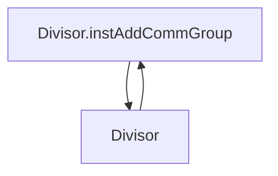
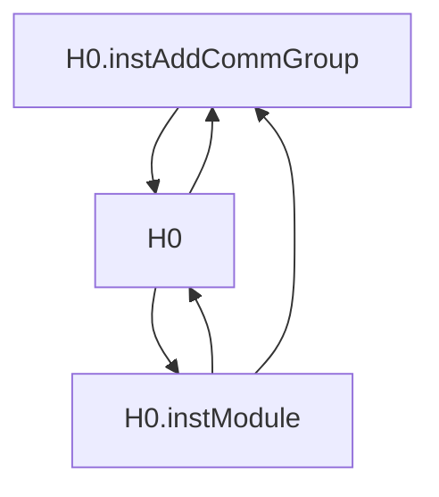
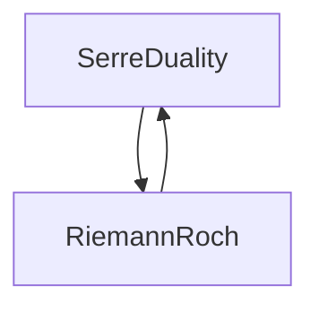
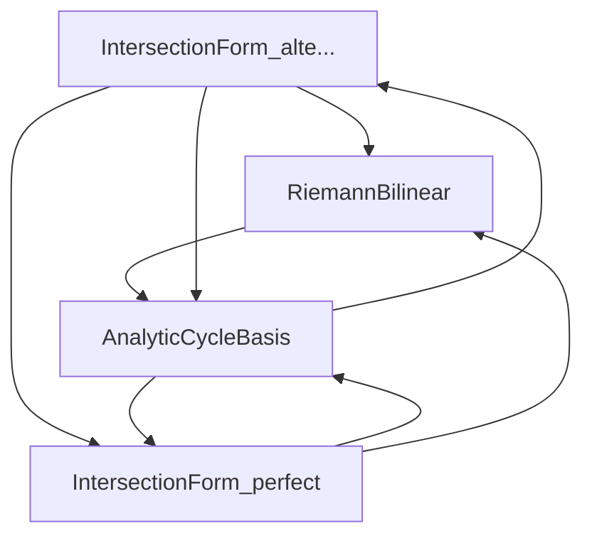
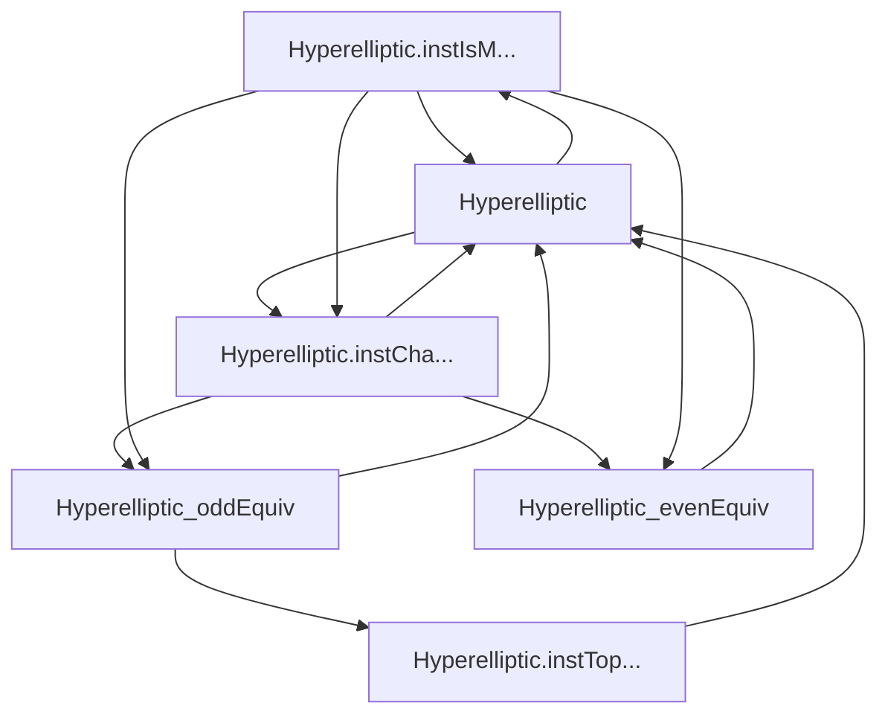
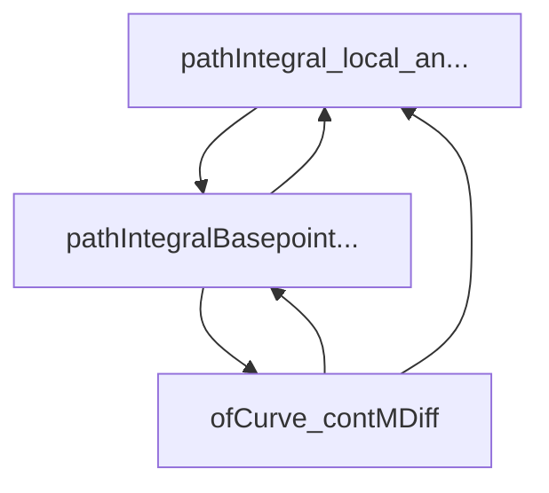
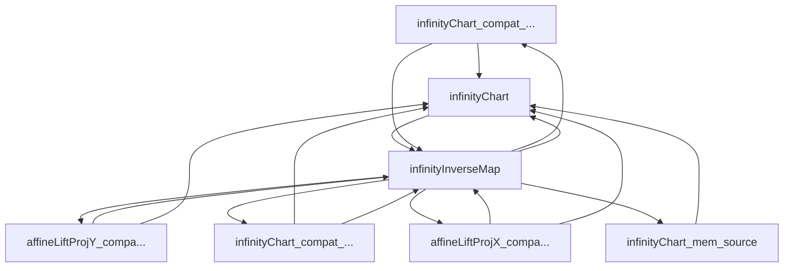
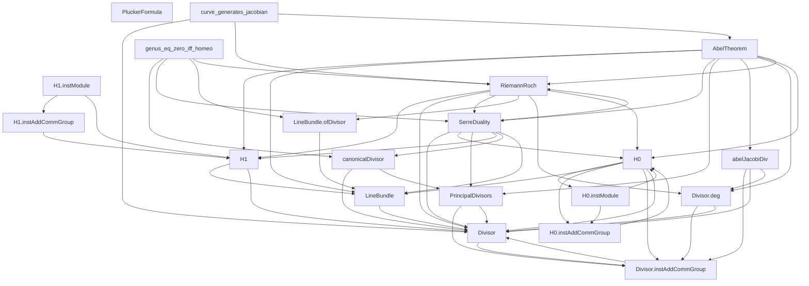

# Cross-Doc Analysis — discharge dependency graph + build sequence

Auto-generated from the 90 vetted recipes in `docs/planning/`. Use this
alongside `ROADMAP.md`: ROADMAP indexes the plans by route; this file
indexes them by their **discharge dependencies on each other**, which
is the right ordering for actual implementation work.

Raw graph in `dependency-graph.json` (nodes + edges + cycles + leaves).

## Headline

- **90** plans, **164** internal dependency edges (parsed from `Blocked by:` fields).
- **18** leaves — plans with zero project-internal prereqs; these are the candidates to start coding.
- **7** nontrivial cycles in the dep graph (each represents an inter-axiom circular dependency to break).
- Maximum dep-depth: **9** levels from leaf to topmost downstream.

## Top-15 fulcrum plans (highest leverage)

Plans cited by the most other plans as a `Blocked by:` prereq. Discharging
a high-leverage plan unblocks the most downstream work; reciprocally, a
bug in a high-leverage plan propagates the most damage.

| Unblocks | Plan | Route | Effort | Verdict |
|---|---|---|---|---|
| **11** | [`Divisor`](Divisor.md) | mathlib-now | 1 | revise |
| **10** | [`Hyperelliptic`](Hyperelliptic.md) | needs-infra | 5 | revise |
| **7** | [`AX_AnalyticCycleBasis`](AX_AnalyticCycleBasis.md) | needs-infra | 10 | reject |
| **7** | [`AX_Hyperelliptic_evenEquiv`](AX_Hyperelliptic_evenEquiv.md) | provable-from-other-axioms | 2 | accept |
| **7** | [`AX_Hyperelliptic_oddEquiv`](AX_Hyperelliptic_oddEquiv.md) | provable-from-other-axioms | 4 | revise |
| **7** | [`PlaneCurve`](PlaneCurve.md) | mathlib-now | 1 | revise |
| **6** | [`H1`](H1.md) | mathlib-now | 2 | reject |
| **6** | [`infinityChart`](infinityChart.md) | provable-from-other-axioms | 7 | revise |
| **5** | [`AX_RiemannBilinear`](AX_RiemannBilinear.md) | mathlib-now | 9 | revise |
| **5** | [`AX_RiemannRoch`](AX_RiemannRoch.md) | provable-from-other-axioms | 10 | reject |
| **5** | [`Divisor-instAddCommGroup`](Divisor-instAddCommGroup.md) | mathlib-now | 1 | revise |
| **5** | [`H0`](H0.md) | needs-infra | 1 | reject |
| **5** | [`LineBundle`](LineBundle.md) | mathlib-now | 1 | reject |
| **5** | [`bridgePath`](bridgePath.md) | needs-infra | 8 | reject |
| **5** | [`infinityInverseMap`](infinityInverseMap.md) | provable-from-other-axioms | 4 | reject |

## Dependency cycles

7 cycle(s). Each must be broken before either end can be discharged.

**Cycle 1** (2 nodes): [`Divisor-instAddCommGroup`](Divisor-instAddCommGroup.md), [`Divisor`](Divisor.md)
**Cycle 2** (3 nodes): [`H0-instAddCommGroup`](H0-instAddCommGroup.md), [`H0-instModule`](H0-instModule.md), [`H0`](H0.md)
**Cycle 3** (2 nodes): [`AX_SerreDuality`](AX_SerreDuality.md), [`AX_RiemannRoch`](AX_RiemannRoch.md)
**Cycle 4** (4 nodes): [`AX_IntersectionForm_alternating`](AX_IntersectionForm_alternating.md), [`AX_IntersectionForm_perfect`](AX_IntersectionForm_perfect.md), [`AX_AnalyticCycleBasis`](AX_AnalyticCycleBasis.md), [`AX_RiemannBilinear`](AX_RiemannBilinear.md)
**Cycle 5** (6 nodes): [`Hyperelliptic-instIsManifold`](Hyperelliptic-instIsManifold.md), [`Hyperelliptic-instTopologicalSpace`](Hyperelliptic-instTopologicalSpace.md), [`AX_Hyperelliptic_oddEquiv`](AX_Hyperelliptic_oddEquiv.md), [`Hyperelliptic-instChartedSpace`](Hyperelliptic-instChartedSpace.md), [`Hyperelliptic`](Hyperelliptic.md), [`AX_Hyperelliptic_evenEquiv`](AX_Hyperelliptic_evenEquiv.md)
**Cycle 6** (3 nodes): [`AX_pathIntegral_local_antiderivative`](AX_pathIntegral_local_antiderivative.md), [`pathIntegralBasepointFunctional`](pathIntegralBasepointFunctional.md), [`AX_ofCurve_contMDiff`](AX_ofCurve_contMDiff.md) — **resolved/obsolete as of 2026-06-07**: `AX_pathIntegral_local_antiderivative` was retired as FALSE (deleted, not proved; path-independence now lives at homology via `loopIntegralToH1`) and `pathIntegralBasepointFunctional` is a real `def`, so this cycle no longer exists.
**Cycle 7** (7 nodes): [`infinityChart_compat_affineLiftProjY`](infinityChart_compat_affineLiftProjY.md), [`affineLiftProjY_compat_infinityChart`](affineLiftProjY_compat_infinityChart.md), [`infinityChart_compat_affineLiftProjX`](infinityChart_compat_affineLiftProjX.md), [`infinityChart_mem_source`](infinityChart_mem_source.md), [`infinityInverseMap`](infinityInverseMap.md), [`infinityChart`](infinityChart.md), [`affineLiftProjX_compat_infinityChart`](affineLiftProjX_compat_infinityChart.md)

## Discharge leaves (no project-internal prereqs)

These 18 plans depend on nothing else in this directory. They
are the legal starting cluster. Sort by `(verdict, effort)` to pick the
first wave.

| Verdict | Effort | Plan | Route | Leverage |
|---|---|---|---|---|
| revise | 1 | [`PlaneCurve`](PlaneCurve.md) | mathlib-now | 7 |
| revise | 2 | [`squareLocalHomeomorph_zero_notMem_source`](squareLocalHomeomorph_zero_notMem_source.md) | mathlib-now | 0 |
| revise | 3 | [`AX_Elliptic_aLoop_analytic`](AX_Elliptic_aLoop_analytic.md) | mathlib-now | 1 |
| revise | 4 | [`AX_BranchLocus`](AX_BranchLocus.md) (now a **theorem**, discharged) | mathlib-now | 3 |
| revise | 5 | [`AX_pushforward_contMDiff`](AX_pushforward_contMDiff.md) (discharged) | needs-infra | 0 |
| revise | 8 | [`AX_H1_ProjectiveLine_trivial`](AX_H1_ProjectiveLine_trivial.md) | needs-infra | 0 |
| reject | 1 | [`ambientPhi_ambientPsi_eq`](ambientPhi_ambientPsi_eq.md) | mathlib-now | 0 |
| reject | 1 | [`polynomialLocalHomeomorph_no_critical_in_source`](polynomialLocalHomeomorph_no_critical_in_source.md) | mathlib-now | 0 |
| reject | 3 | [`intersectionForm`](intersectionForm.md) | needs-infra | 3 |
| reject | 4 | [`loopIntegralToH1`](loopIntegralToH1.md) | provable-from-other-axioms | 1 |
| reject | 5 | [`AX_PlaneCurveAffine_nonempty`](AX_PlaneCurveAffine_nonempty.md) | mathlib-now | 2 |
| reject | 5 | [`AX_HyperellipticForm_polynomial_decomposition`](AX_HyperellipticForm_polynomial_decomposition.md) | genuine-textbook | 1 |
| reject | 6 | [`infinityLiftChart_compat_affineLiftChart`](infinityLiftChart_compat_affineLiftChart.md) | mathlib-now | 1 |
| reject | 6 | [`contDiffOn_symm_toOpenPartialHomeomorph`](contDiffOn_symm_toOpenPartialHomeomorph.md) | mathlib-now | 0 |
| reject | 8 | [`bridgePath`](bridgePath.md) | needs-infra | 5 |
| reject | 8 | [`AX_HyperellipticAffine_connected`](AX_HyperellipticAffine_connected.md) | needs-infra | 1 |
| reject | 8 | [`AX_PluckerFormula`](AX_PluckerFormula.md) | genuine-textbook | 0 |
| reject | 10 | [`AX_PlaneCurveAffine_connected`](AX_PlaneCurveAffine_connected.md) | genuine-textbook | 1 |

## Phased build sequence

Plans are grouped by **dep-depth level** (longest path of internal
`Blocked by:` edges from a leaf). Within each level, ordered by
`(verdict, effort, −leverage)`. Phase 1 (level 0) is the leaves above;
Phase 2 only blocks on Phase 1; etc.

### Phase 1 (depth 0) — 18 plans

| Plan | Route | Eff | V | Lev | Blocks-on (internal) |
|---|---|---|---|---|---|
| [`PlaneCurve`](PlaneCurve.md) | mathlib-now | 1 | revise | 7 | — |
| [`squareLocalHomeomorph_zero_notMem_source`](squareLocalHomeomorph_zero_notMem_source.md) | mathlib-now | 2 | revise | 0 | — |
| [`AX_Elliptic_aLoop_analytic`](AX_Elliptic_aLoop_analytic.md) | mathlib-now | 3 | revise | 1 | — |
| [`AX_BranchLocus`](AX_BranchLocus.md) | mathlib-now | 4 | revise | 3 | — |
| [`AX_pushforward_contMDiff`](AX_pushforward_contMDiff.md) | needs-infra | 5 | revise | 0 | — |
| [`AX_H1_ProjectiveLine_trivial`](AX_H1_ProjectiveLine_trivial.md) | needs-infra | 8 | revise | 0 | — |
| [`ambientPhi_ambientPsi_eq`](ambientPhi_ambientPsi_eq.md) | mathlib-now | 1 | reject | 0 | — |
| [`polynomialLocalHomeomorph_no_critical_in_source`](polynomialLocalHomeomorph_no_critical_in_source.md) | mathlib-now | 1 | reject | 0 | — |
| [`intersectionForm`](intersectionForm.md) | needs-infra | 3 | reject | 3 | — |
| [`loopIntegralToH1`](loopIntegralToH1.md) | provable-from-other-axioms | 4 | reject | 1 | — |
| [`AX_PlaneCurveAffine_nonempty`](AX_PlaneCurveAffine_nonempty.md) | mathlib-now | 5 | reject | 2 | — |
| [`AX_HyperellipticForm_polynomial_decomposition`](AX_HyperellipticForm_polynomial_decomposition.md) | genuine-textbook | 5 | reject | 1 | — |
| [`infinityLiftChart_compat_affineLiftChart`](infinityLiftChart_compat_affineLiftChart.md) | mathlib-now | 6 | reject | 1 | — |
| [`contDiffOn_symm_toOpenPartialHomeomorph`](contDiffOn_symm_toOpenPartialHomeomorph.md) | mathlib-now | 6 | reject | 0 | — |
| [`bridgePath`](bridgePath.md) | needs-infra | 8 | reject | 5 | — |
| [`AX_HyperellipticAffine_connected`](AX_HyperellipticAffine_connected.md) | needs-infra | 8 | reject | 1 | — |
| [`AX_PluckerFormula`](AX_PluckerFormula.md) | genuine-textbook | 8 | reject | 0 | — |
| [`AX_PlaneCurveAffine_connected`](AX_PlaneCurveAffine_connected.md) | genuine-textbook | 10 | reject | 1 | — |

### Phase 2 (depth 1) — 24 plans

| Plan | Route | Eff | V | Lev | Blocks-on (internal) |
|---|---|---|---|---|---|
| [`infinityChart_mem_source`](infinityChart_mem_source.md) | provable-from-other-axioms | 1 | accept | 1 | `infinityChart` |
| [`bridgePath_at_one`](bridgePath_at_one.md) | provable-from-other-axioms | 1 | accept | 0 | `bridgePath` |
| [`bridgePath_at_zero`](bridgePath_at_zero.md) | provable-from-other-axioms | 1 | accept | 0 | `bridgePath` |
| [`bridgePath_continuous`](bridgePath_continuous.md) | provable-from-other-axioms | 2 | accept | 0 | `bridgePath` |
| [`infinityChart_compat_affineLiftProjX`](infinityChart_compat_affineLiftProjX.md) | provable-from-other-axioms | 3 | accept | 1 | `infinityChart`, `infinityInverseMap` |
| [`infinityChart_compat_affineLiftProjY`](infinityChart_compat_affineLiftProjY.md) | provable-from-other-axioms | 3 | accept | 1 | `infinityChart`, `infinityInverseMap` |
| [`Divisor-instAddCommGroup`](Divisor-instAddCommGroup.md) | mathlib-now | 1 | revise | 5 | `Divisor` |
| [`H0-instAddCommGroup`](H0-instAddCommGroup.md) | needs-infra | 1 | revise | 2 | `H0` |
| [`PlaneCurve-instNonempty`](PlaneCurve-instNonempty.md) | needs-infra | 1 | revise | 0 | `AX_PlaneCurveAffine_nonempty`, `PlaneCurve` |
| [`PlaneCurve-instTopologicalSpace`](PlaneCurve-instTopologicalSpace.md) | needs-infra | 1 | revise | 0 | `PlaneCurve` |
| [`affineLiftProjY_compat_infinityChart`](affineLiftProjY_compat_infinityChart.md) | provable-from-other-axioms | 3 | revise | 1 | `infinityChart`, `infinityInverseMap` |
| [`AX_Elliptic_bLoop_analytic`](AX_Elliptic_bLoop_analytic.md) | mathlib-now | 3 | revise | 0 | `AX_Elliptic_aLoop_analytic` |
| [`AX_HyperellipticOneForm_eq_form`](AX_HyperellipticOneForm_eq_form.md) | provable-from-other-axioms | 4 | revise | 0 | `AX_HyperellipticForm_polynomial_decomposition` |
| [`PlaneCurve-instConnectedSpace`](PlaneCurve-instConnectedSpace.md) | provable-from-other-axioms | 4 | revise | 0 | `AX_PlaneCurveAffine_connected`, `PlaneCurve` |
| [`PlaneCurve-instT2Space`](PlaneCurve-instT2Space.md) | needs-infra | 5 | revise | 0 | `PlaneCurve` |
| [`PlaneCurve-instCompactSpace`](PlaneCurve-instCompactSpace.md) | provable-from-other-axioms | 6 | revise | 0 | `PlaneCurve` |
| [`PlaneCurve-instChartedSpace`](PlaneCurve-instChartedSpace.md) | needs-infra | 8 | revise | 1 | `PlaneCurve` |
| [`Hyperelliptic-instTopologicalSpace`](Hyperelliptic-instTopologicalSpace.md) | needs-infra | 2 | reject | 4 | `Hyperelliptic` |
| [`affineLiftChart_compat_infinityLiftChart`](affineLiftChart_compat_infinityLiftChart.md) | mathlib-now | 7 | reject | 0 | `infinityLiftChart_compat_affineLiftChart` |
| [`bridgePath_chart_differentiable`](bridgePath_chart_differentiable.md) | needs-infra | 8 | reject | 1 | `bridgePath` |
| [`AX_PlaneCurveAffine_noncompact`](AX_PlaneCurveAffine_noncompact.md) | needs-infra | 8 | reject | 0 | `AX_PlaneCurveAffine_nonempty` |
| [`AX_pathIntegral_local_antiderivative`](AX_pathIntegral_local_antiderivative.md) | needs-infra | 9 | reject | 2 | `pathIntegralBasepointFunctional` |
| [`AX_IntersectionForm_perfect`](AX_IntersectionForm_perfect.md) | needs-infra | 10 | reject | 3 | `AX_AnalyticCycleBasis`, `AX_RiemannBilinear`, `intersectionForm` |
| [`pushforwardOneForm`](pushforwardOneForm.md) | needs-infra | 10 | reject | 3 | `AX_BranchLocus` |

### Phase 3 (depth 2) — 10 plans

| Plan | Route | Eff | V | Lev | Blocks-on (internal) |
|---|---|---|---|---|---|
| [`Divisor`](Divisor.md) | mathlib-now | 1 | revise | 11 | `Divisor-instAddCommGroup` |
| [`H0-instModule`](H0-instModule.md) | mathlib-now | 1 | revise | 1 | `H0`, `H0-instAddCommGroup` |
| [`AX_pushforwardOneForm_id`](AX_pushforwardOneForm_id.md) | needs-infra | 3 | revise | 0 | `pushforwardOneForm` |
| [`AX_Hyperelliptic_oddEquiv`](AX_Hyperelliptic_oddEquiv.md) | provable-from-other-axioms | 4 | revise | 7 | `Hyperelliptic`, `Hyperelliptic-instTopologicalSpace` |
| [`infinityInverseMap`](infinityInverseMap.md) | provable-from-other-axioms | 4 | reject | 5 | `affineLiftProjX_compat_infinityChart`, `affineLiftProjY_compat_infinityChart`, `infinityChart`, `infinityChart_compat_affineLiftProjX`, `infinityChart_compat_affineLiftProjY` (+1 more) |
| [`bridgePath_lineIntegrable`](bridgePath_lineIntegrable.md) | provable-from-other-axioms | 6 | reject | 0 | `bridgePath`, `bridgePath_chart_differentiable` |
| [`AX_pushforward_pullback`](AX_pushforward_pullback.md) | genuine-textbook | 8 | reject | 0 | `AX_BranchLocus`, `pushforwardOneForm` |
| [`AX_pushforwardOneForm_comp`](AX_pushforwardOneForm_comp.md) | needs-infra | 9 | reject | 0 | `pushforwardOneForm` |
| [`PlaneCurve-instIsManifold`](PlaneCurve-instIsManifold.md) | genuine-textbook | 9 | reject | 0 | `PlaneCurve`, `PlaneCurve-instChartedSpace` |
| [`AX_IntersectionForm_alternating`](AX_IntersectionForm_alternating.md) | needs-infra | 10 | reject | 2 | `AX_AnalyticCycleBasis`, `AX_IntersectionForm_perfect`, `AX_RiemannBilinear`, `intersectionForm` |

### Phase 4 (depth 3) — 6 plans

| Plan | Route | Eff | V | Lev | Blocks-on (internal) |
|---|---|---|---|---|---|
| [`Divisor-deg`](Divisor-deg.md) | mathlib-now | 1 | accept | 3 | `Divisor`, `Divisor-instAddCommGroup` |
| [`Hyperelliptic-instChartedSpace`](Hyperelliptic-instChartedSpace.md) | needs-infra | 3 | revise | 2 | `AX_Hyperelliptic_evenEquiv`, `AX_Hyperelliptic_oddEquiv`, `Hyperelliptic` |
| [`infinityChart`](infinityChart.md) | provable-from-other-axioms | 7 | revise | 6 | `infinityInverseMap` |
| [`LineBundle`](LineBundle.md) | mathlib-now | 1 | reject | 5 | `Divisor` |
| [`PrincipalDivisors`](PrincipalDivisors.md) | needs-infra | 2 | reject | 3 | `Divisor`, `Divisor-instAddCommGroup` |
| [`AX_AnalyticCycleBasis`](AX_AnalyticCycleBasis.md) | needs-infra | 10 | reject | 7 | `AX_IntersectionForm_alternating`, `AX_IntersectionForm_perfect` |

### Phase 5 (depth 4) — 8 plans

| Plan | Route | Eff | V | Lev | Blocks-on (internal) |
|---|---|---|---|---|---|
| [`affineLiftProjX_compat_infinityChart`](affineLiftProjX_compat_infinityChart.md) | provable-from-other-axioms | 3 | accept | 1 | `infinityChart`, `infinityInverseMap` |
| [`LineBundle-ofDivisor`](LineBundle-ofDivisor.md) | mathlib-now | 1 | revise | 2 | `LineBundle` |
| [`abelJacobiDiv`](abelJacobiDiv.md) | needs-infra | 1 | revise | 1 | `Divisor`, `Divisor-deg`, `Divisor-instAddCommGroup` |
| [`Hyperelliptic-instIsManifold`](Hyperelliptic-instIsManifold.md) | needs-infra | 8 | revise | 1 | `AX_Hyperelliptic_evenEquiv`, `AX_Hyperelliptic_oddEquiv`, `Hyperelliptic`, `Hyperelliptic-instChartedSpace` |
| [`AX_RiemannBilinear`](AX_RiemannBilinear.md) | mathlib-now | 9 | revise | 5 | `AX_AnalyticCycleBasis`, `loopIntegralToH1` |
| [`H0`](H0.md) | needs-infra | 1 | reject | 5 | `Divisor`, `Divisor-instAddCommGroup`, `H0-instAddCommGroup`, `H0-instModule`, `LineBundle` |
| [`H1`](H1.md) | mathlib-now | 2 | reject | 6 | `Divisor`, `LineBundle` |
| [`canonicalDivisor`](canonicalDivisor.md) | needs-infra | 10 | reject | 2 | `Divisor`, `PrincipalDivisors` |

### Phase 6 (depth 5) — 5 plans

| Plan | Route | Eff | V | Lev | Blocks-on (internal) |
|---|---|---|---|---|---|
| [`AX_PeriodLattice`](AX_PeriodLattice.md) | provable-from-other-axioms | 4 | accept | 4 | `AX_RiemannBilinear` |
| [`H1-instAddCommGroup`](H1-instAddCommGroup.md) | needs-infra | 1 | revise | 1 | `H1` |
| [`Hyperelliptic`](Hyperelliptic.md) | needs-infra | 5 | revise | 10 | `Hyperelliptic-instChartedSpace`, `Hyperelliptic-instIsManifold` |
| [`AX_Elliptic_H1_symplectic`](AX_Elliptic_H1_symplectic.md) | provable-from-other-axioms | 7 | reject | 0 | `AX_AnalyticCycleBasis`, `AX_IntersectionForm_alternating`, `AX_IntersectionForm_perfect`, `H1`, `intersectionForm` |
| [`AX_SerreDuality`](AX_SerreDuality.md) | mathlib-now | 10 | reject | 4 | `AX_RiemannRoch`, `Divisor`, `H0`, `H1`, `LineBundle` (+2 more) |

### Phase 7 (depth 6) — 6 plans

| Plan | Route | Eff | V | Lev | Blocks-on (internal) |
|---|---|---|---|---|---|
| [`H1-instModule`](H1-instModule.md) | mathlib-now | 1 | accept | 0 | `H1`, `H1-instAddCommGroup` |
| [`AX_Hyperelliptic_evenEquiv`](AX_Hyperelliptic_evenEquiv.md) | provable-from-other-axioms | 2 | accept | 7 | `Hyperelliptic` |
| [`instPeriodLatticeDiscrete`](instPeriodLatticeDiscrete.md) | provable-from-other-axioms | 4 | revise | 0 | `AX_PeriodLattice`, `AX_RiemannBilinear` |
| [`AX_pushforwardAmbient_preserves_lattice`](AX_pushforwardAmbient_preserves_lattice.md) | needs-infra | 8 | reject | 0 | `AX_AnalyticCycleBasis`, `AX_PeriodLattice` |
| [`AX_pullbackAmbient_preserves_lattice`](AX_pullbackAmbient_preserves_lattice.md) | needs-infra | 9 | reject | 1 | `AX_AnalyticCycleBasis`, `AX_BranchLocus`, `AX_PeriodLattice` |
| [`AX_RiemannRoch`](AX_RiemannRoch.md) | provable-from-other-axioms | 10 | reject | 5 | `AX_SerreDuality`, `Divisor`, `Divisor-deg`, `H0`, `H1` (+1 more) |

### Phase 8 (depth 7) — 9 plans

| Plan | Route | Eff | V | Lev | Blocks-on (internal) |
|---|---|---|---|---|---|
| [`Hyperelliptic-instCompactSpace`](Hyperelliptic-instCompactSpace.md) | provable-from-other-axioms | 1 | accept | 0 | `AX_Hyperelliptic_evenEquiv`, `AX_Hyperelliptic_oddEquiv`, `Hyperelliptic`, `Hyperelliptic-instTopologicalSpace` |
| [`Hyperelliptic-instConnectedSpace`](Hyperelliptic-instConnectedSpace.md) | provable-from-other-axioms | 1 | accept | 0 | `AX_HyperellipticAffine_connected`, `AX_Hyperelliptic_evenEquiv`, `AX_Hyperelliptic_oddEquiv`, `Hyperelliptic`, `Hyperelliptic-instTopologicalSpace` |
| [`AX_pullback_contMDiff`](AX_pullback_contMDiff.md) | provable-from-other-axioms | 1 | revise | 0 | `AX_pullbackAmbient_preserves_lattice` |
| [`Hyperelliptic-instNonempty`](Hyperelliptic-instNonempty.md) | provable-from-other-axioms | 1 | revise | 0 | `AX_Hyperelliptic_evenEquiv`, `AX_Hyperelliptic_oddEquiv`, `Hyperelliptic` |
| [`Hyperelliptic-instT2Space`](Hyperelliptic-instT2Space.md) | provable-from-other-axioms | 1 | revise | 0 | `AX_Hyperelliptic_evenEquiv`, `AX_Hyperelliptic_oddEquiv`, `Hyperelliptic`, `Hyperelliptic-instTopologicalSpace` |
| [`AX_AbelTheorem`](AX_AbelTheorem.md) | needs-infra | 8 | revise | 1 | `AX_AnalyticCycleBasis`, `AX_PeriodLattice`, `AX_RiemannBilinear`, `AX_RiemannRoch`, `AX_SerreDuality` (+6 more) |
| [`AX_Hyperelliptic_genus`](AX_Hyperelliptic_genus.md) | provable-from-other-axioms | 2 | reject | 0 | `AX_Hyperelliptic_evenEquiv`, `AX_Hyperelliptic_oddEquiv`, `Hyperelliptic` |
| [`AX_genus_eq_zero_iff_homeo`](AX_genus_eq_zero_iff_homeo.md) | provable-from-other-axioms | 6 | reject | 1 | `AX_RiemannRoch`, `AX_SerreDuality`, `LineBundle-ofDivisor`, `canonicalDivisor` |
| [`AX_ofCurve_inj`](AX_ofCurve_inj.md) | needs-infra | 9 | reject | 1 | `AX_RiemannRoch`, `AX_SerreDuality` |

### Phase 9 (depth 8) — 3 plans

| Plan | Route | Eff | V | Lev | Blocks-on (internal) |
|---|---|---|---|---|---|
| [`genus_eq_zero_iff_homeo`](genus_eq_zero_iff_homeo.md) | provable-from-other-axioms | 1 | revise | 0 | `AX_genus_eq_zero_iff_homeo` |
| [`AX_curve_generates_jacobian`](AX_curve_generates_jacobian.md) | provable-from-other-axioms | 3 | reject | 0 | `AX_AbelTheorem`, `AX_RiemannRoch`, `Divisor` |
| [`pathIntegralBasepointFunctional`](pathIntegralBasepointFunctional.md) | needs-infra | 8 | reject | 2 | `AX_ofCurve_contMDiff`, `AX_ofCurve_inj`, `AX_pathIntegral_local_antiderivative` |

### Phase 10 (depth 9) — 1 plans

| Plan | Route | Eff | V | Lev | Blocks-on (internal) |
|---|---|---|---|---|---|
| [`AX_ofCurve_contMDiff`](AX_ofCurve_contMDiff.md) | provable-from-other-axioms | 7 | revise | 1 | `AX_pathIntegral_local_antiderivative`, `pathIntegralBasepointFunctional` |

## Orphan prereq mentions

Identifiers in `Blocked by:` fields that look like axioms/decls but are
**not** the slug of any plan. Either (a) project decls in other files
(`Vendor/Wallace/HolomorphicMap.lean`, etc.), (b) Mathlib decls (usually
fine), or (c) genuine orphans where a plan blocks on something nobody is
addressing.

Top 10 most-cited (showing count):

| Mentions | Identifier |
|---|---|
| 2 | `intersectionForm.md` |
| 1 | `Mathlib.Analysis.Complex.OpenMapping` |
| 1 | `Path.toHomologyClass` |
| 1 | `FundamentalGroupoid.vanKampen` |
| 1 | `HyperellipticData` |
| 1 | `AX_IntersectionForm_nondeg` |
| 1 | `LineBundle.lean` |
| 1 | `INFRA_ExponentialSequence` |
| 1 | `CauchyTheorem_local` |
| 1 | `Jacobians.GeneralResults.transition_fderiv_mul` |

---

**Recommended start.** Discharge the `accept`-verdict leaves first (zero
internal prereqs, Gemini didn't flag the recipe). Then walk Phase 2 in
`accept` then `revise` then `reject` order. Save the highest-leverage
plans (sheaf-cohomology layer, manifold-OMT, `bridgePath`) for a
focused effort once the cheap discharges have validated the gate +
recipe template end-to-end.

## Cycle-breaking guidance

Each cycle below requires a strategy *outside the plans themselves* — usually
a temporary axiomatization or a structural restructure — before any node in
the cycle can be discharged. Order: easiest break first.

### Cycle 1 — `Divisor` ↔ `Divisor.instAddCommGroup` (type ↔ instance)

**Pattern:** the type's instance refers to the type; the type's recipe assumes the instance to talk about its group structure. Standard Lean idiom. **Break:** discharge `Divisor` first as `def Divisor X := FreeAbelianGroup X` (no instance dep — Mathlib gives the AddCommGroup automatically). The instance plan then collapses to a one-liner `instance : AddCommGroup (Divisor X) := inferInstance`. Effort: combined ~1 hour.

### Cycle 2 — `H0` ↔ `H0.instAddCommGroup` ↔ `H0.instModule` (type ↔ 2 instances)

**Pattern:** same as Cycle 1, just 3-way. **Break:** define `H0` as the right concrete type (sheaf-sections record / function space), then both instances are `inferInstance` once the underlying carrier carries `AddCommGroup` and `Module ℂ`. NOTE: this only collapses once the **sheaf-cohomology layer** is real; until then, the cluster remains axiom-bound.

### Cycle 3 — `AX_RiemannRoch` ↔ `AX_SerreDuality` (math-level mutual)

**Pattern:** classical RR ↔ SD pairing. Forster proves them in the same chapter precisely because each lemma uses the other in places. **Break:** axiomatize **`AX_SerreDuality`** as `needs-infra` (it sits on top of differential-form integration on Riemann surfaces, the harder substrate) and discharge `AX_RiemannRoch`'s Euler-characteristic induction against it. Once Čech + Dolbeault land, attack SD from harmonic representatives — the RR proof no longer needs SD then. **Do not discharge them simultaneously.**

### Cycle 4 — `AnalyticCycleBasis` ↔ `IntersectionForm.{alternating,perfect}` ↔ `RiemannBilinear` (homology layer)

**Pattern:** the densest math entanglement. CycleBasis needs an alternating perfect intersection form to express symplectic structure; the intersection-form properties need a cycle basis to compute on; RiemannBilinear needs both to state the Hodge inner product. **Break:** introduce a *proof-of-existence layer*: prove **`AX_AnalyticCycleBasis`** first using Radó triangulation (Forster Ch.I §22) — this gives the basis without needing the intersection form's properties (only the form itself). Then the alternating+perfect properties follow from the basis. RiemannBilinear sits downstream of all three. **Effort:** AnalyticCycleBasis is the choke; once discharged the rest collapses.

### Cycle 5 — Unified `Hyperelliptic` + 5 instances + `oddEquiv`/`evenEquiv` (parity dispatch)

**Pattern:** `Hyperelliptic H` is defined via parity dispatch on `H.f.natDegree`. The instances reference `Hyperelliptic`; the homeo axioms `oddEquiv` / `evenEquiv` reference both `Hyperelliptic` and the parity-specific types (`HyperellipticOdd` / `HyperellipticEvenProj`). **Break:** discharge **`Hyperelliptic`** as a real `def` first via `dite (Odd H.f.natDegree) (λ h => HyperellipticOdd H h) (λ h => HyperellipticEvenProj H)`. The two homeos collapse to `rfl` / `Equiv.refl`; the 5 instances inherit via `oddEquiv` / `evenEquiv`. **Effort:** the parity-dispatch type itself is ~30 LOC; the whole cluster collapses in ~1 day.

### Cycle 6 — `pathIntegralBasepointFunctional` ↔ `AX_pathIntegral_local_antiderivative` ↔ `AX_ofCurve_contMDiff` (path-integral)

**Resolved/obsolete as of 2026-06-07.** `AX_pathIntegral_local_antiderivative` was **retired as FALSE** (deleted, not proved — a single-valued ℂ open-path "FTC" forces zero periods); path-independence now lives at homology via `loopIntegralToH1`, and `pathIntegralBasepointFunctional` is a real `def`. The cycle below no longer exists; the analysis is retained for history.

**Pattern (historical):** the path-integral functional is the data; local-antiderivative is its FTC property; ofCurve_contMDiff uses both to argue the Abel-Jacobi map is smooth. The dep cycle arises because each plan cites the others in its `Blocked by:`. **Break:** discharge **`pathIntegralBasepointFunctional`** as a real `def` once `loopIntegralToH1` + `pathIntegralAnalyticArc` infrastructure land (see fulcrum analysis). Then FTC `_local_antiderivative` follows; then `_ofCurve_contMDiff` is `ContMDiff.comp` + FTC + manifold quotient. ORDER MATTERS.

### Cycle 7 — odd-atlas infinity chart cluster (7 nodes)

**Pattern:** the 7 axioms in `OddAtlas/InfinityChart.lean` are a self-contained atlas-build package. `infinityChart` (an `OpenPartialHomeomorph`) bundles `infinityInverseMap` + the 4 transition-compat axioms + the `mem_source` membership lemma. The cycle arises because each `_compat_*` plan cites `infinityChart` (which is what it's the compat of) AND vice-versa. **Break:** discharge **`infinityInverseMap`** first (power-series inversion of `y/x^{g+1}` near ∞ — the underlying analytic content). Then `infinityChart` is the IFT bundle. The 4 chart-transition compats and `mem_source` then follow from the definitions. **Effort:** ~1 week for the full cluster once `infinityInverseMap` is provided; the inverse-map itself is the hard step.

## Sheaf-cohomology layer subgraph (the highest-leverage cluster)

The blocking structure around `RiemannSurface/LineBundle.lean` axioms,
plus the downstream theorems that wait on them. Building this layer is
the single highest-leverage move on the board: it unblocks ~20 plans.

## Cross-plan consistency findings (Gemini 3.1 Pro)

The per-plan vetting could not surface inconsistencies *between* plans. A
second Gemini pass fed each route cluster as one bundle and asked for
drift / signature splits / mutual-no-anchor / duplicate / stale-prereq
issues. Full critiques in `_vetting/CROSS_PLAN_CONSISTENCY*.md`; summary:

| Cluster | Plans | Findings | Verdict tail |
|---|---|---|---|
| `mathlib-now` | 21 | **5** | Identified one duplicated helper lemma, a fatal signature mismatch breaking line bundle sheaf cohomo… |
| `provable-from-other-axioms` | 31 | **4** | The cluster shows critical signature splits around manifold equivalences, topological group types, a… |
| `needs-infra` | 33 | **5** | We found severe structural collisions where plans overwrite each other's target declarations, duplic… |
| `genuine-textbook` | 5 | **1** | The plans reveal a structural signature split in the project's model-space notation (`𝓘(ℂ)` vs `𝓘(ℂ,… |

**Total cross-plan findings: 15** (all flagged actionable by Gemini).
These are NOT folded back into the per-plan recipes — review and patch each
by hand against the cited critique file.

### `mathlib-now` — 5 findings
Full: [`_vetting/CROSS_PLAN_CONSISTENCY.md`](_vetting/CROSS_PLAN_CONSISTENCY.md)

1. **Divergent complex torus helpers**
2. **Line bundle representation mismatch**
3. **Divisor mutual dependency loop**
4. **Dropped instance binders in Divisor instances**
5. **Stale circularity expectation for chart transitions**

### `provable-from-other-axioms` — 4 findings
Full: [`_vetting/CROSS_PLAN_CONSISTENCY_provable-from-other-axioms.md`](_vetting/CROSS_PLAN_CONSISTENCY_provable-from-other-axioms.md)

1. **Signature split on Hyperelliptic equivalences**
2. **Signature split on H1 group operation**
3. **Signature split on Riemann-Roch formulation**
4. **Mathlib-decl drift on PartialHomeomorph**

### `needs-infra` — 5 findings
Full: [`_vetting/CROSS_PLAN_CONSISTENCY_needs-infra.md`](_vetting/CROSS_PLAN_CONSISTENCY_needs-infra.md)

1. **Typeclass bundling invalidates companion proofs**
2. **Incompatible basepoint handling for `abelJacobiDiv`**
3. **Conflicting implementations of path integration**
4. **Duplicate topological instances for `Hyperelliptic`**
5. **Divergent infrastructures for Abel-Jacobi injectivity**

### `genuine-textbook` — 1 findings
Full: [`_vetting/CROSS_PLAN_CONSISTENCY_genuine-textbook.md`](_vetting/CROSS_PLAN_CONSISTENCY_genuine-textbook.md)

1. **Incompatible `IsManifold` model space signatures**
